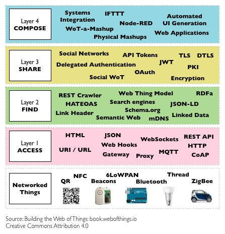
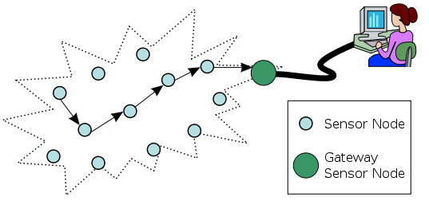
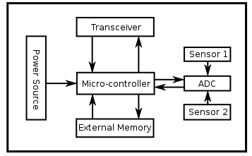

# Conceptos Técnicos

A continuación una serie de conceptos técnicos:

## Web of Things (WoT)
---
The Web of Things (WoT) is a term used to describe approaches, software architectural styles and programming patterns that allow real-world objects to be part of the World Wide Web. Similarly to what the Web (Application Layer) is to the Internet (Network Layer),[1] the Web of Things provides an Application Layer that simplifies the creation of Internet of Things applications.

Rather than re-inventing completely new standards, the Web of Things reuses existing and well-known Web standards used in the programmable Web (e.g., REST, HTTP, JSON), semantic Web (e.g., JSON-LD, Microdata, etc.), the real-time Web (e.g., Websockets) and the social Web (e.g., oauth or social networks).

### Architecture

* **Accessibility layer**

  This layer deals with the access of things to the Internet and ensure they expose their services via Web APIs. This is the core layer of the WoT as it ensures things have a Web accessible API, transforming them into programmable things.

 The access layer in the WoT is built around two core patterns: Firstly, all things should be exposing their services through a RESTful API (either directly or through gateway).[3] REST is an architectural style at the root of the programmable Web thanks to its implementation in HTTP 1.1. As a consequence, if things offer RESTful APIs over HTTP, they get a URL and become seamlessly integrated to the World Wide Web and its tools such as browsers, hyperlinked HTML pages and Javascript applications.

 Several designs describing how to the services offered by things can be accessed via REST have been proposed.

 Secondly, the request-response nature of HTTP is often cited as one of the limitations for IoT use-cases as it does not match the event-driven nature of applications that are common in the Wireless Sensor Networks. To overcome this shortcoming while keeping a focus on fostering integration with the Web, several authors have suggested the use of HTML5 Websockets either natively or through the use of translation brokers (e.g., translating from MQTT or CoAP to Websockets). This complements the REST API of things with a publish subscribe mechanism that is largely integrated with the Web eco-system.

 Some things can connect directly to the Internet (e.g., using Ethernet, WiFi or GSM/3G), but in other cases (for example when devices are battery-powered) devices can access the Internet through Smart Gateways. Smart Gateway are protocol translation gateways at the edge of the network.

* **Findability layer**

  The focus of this layer is to provide a way to find and locate things on the Web and hence is strongly influenced by the semantic Web.[5][10]

 The approach here is to reuse Web semantic standards to describe things and their services. In particular, people have been working on HTML5 Microdata integration, RDF / RDFa, JSON-LD and EXI.[5][8][10] This enables searching for things through search engines and other Web indexes as well as enabling machine to machine interaction based on a small set of well-defined formats and standards.

* **Sharing layer**

  The Web of Things is largely based on the idea of things pushing data to the Web where more intelligence and big-data patterns can be applied as an example to help us manage our health (Wearables), optimise our energy consumption (Smart Grid), etc. This, however, can only happen in a large-scale way if some of the data can be efficiently shared across services. The sharing layer ensures that data generated by things can be shared in an efficient and secure manner.

 Several approaches towards a granular and social context based sharing have been proposed such as the use of social network to build a Social Web of Things.

* **Composition layer**

  The role of the last layer is to integrate the services and data offered by things into higher level Web tools (analytics software, mashup applications such as IFTTT), making it even simpler to create applications involving things and virtual Web services.

 Tools in the composition layer range from Web toolkits (e.g., Javascript SDKs offering higher-level abstractions) to dashboards with programmable widgets and Physical Mashup tools. Inspired by Web 2.0 participatory services and in particular Web mashups, the Physical Mashups offer a unified view of the classical Web and Web of Things and empower people to build applications using the Web of Things services without requiring programming skills.

 A number of Web of Things Physical Mashup have been developed and tools have been proposed and are being actively developed such as.

## Wireless Sensor Network (WSN) 
---
Wireless sensor networks (WSN), sometimes called wireless sensor and actuator networks (WSAN),are spatially distributed autonomous sensors to monitor physical or environmental conditions, such as temperature, sound, pressure, etc. and to cooperatively pass their data through the network to a main location. The more modern networks are bi-directional, also enabling control of sensor activity. The development of wireless sensor networks was motivated by military applications such as battlefield surveillance; today such networks are used in many industrial and consumer applications, such as industrial process monitoring and control, machine health monitoring, and so on.

The WSN is built of "nodes" – from a few to several hundreds or even thousands, where each node is connected to one (or sometimes several) sensors. Each such sensor network node has typically several parts: a radio transceiver with an internal antenna or connection to an external antenna, a microcontroller, an electronic circuit for interfacing with the sensors and an energy source, usually a battery or an embedded form of energy harvesting. A sensor node might vary in size from that of a shoebox down to the size of a grain of dust, although functioning "motes" of genuine microscopic dimensions have yet to be created. The cost of sensor nodes is similarly variable, ranging from a few to hundreds of dollars, depending on the complexity of the individual sensor nodes. Size and cost constraints on sensor nodes result in corresponding constraints on resources such as energy, memory, computational speed and communications bandwidth. The topology of the WSNs can vary from a simple star network to an advanced multi-hop wireless mesh network. The propagation technique between the hops of the network can be routing or flooding.

In computer science and telecommunications, wireless sensor networks are an active research area with numerous workshops and conferences arranged each year, for example IPSN, SenSys, and EWSN.

### Sensor Node

A **sensor node**, also known as a **mote** (chiefly in North America), is a node in a sensor network that is capable of performing some processing, gathering sensory information and communicating with other connected nodes in the network. **A mote is a node but a node is not always a mote**.

The main components of a sensor node are:
  * Microcontroller
  * Transceiver
  * External memory
  * Power source
  * One or more sensors

  * **Controller**
  
  The controller performs tasks, processes data and controls the functionality of other components in the sensor node. While the most common controller is a **microcontroller**, other alternatives that can be used as a controller are: 
    * A general purpose desktop microprocessor
    * Digital signal processors (DSP)
    * FPGAs 
    * ASICs

  A microcontroller is often used in many embedded systems such as *sensor nodes* because of its:
    * Low cost
    * Flexibility to connect to other devices
    * Ease of programming
    * Low power consumption

  A *general purpose microprocessor* generally has a higher power consumption than a microcontroller, therefore it is often not considered a suitable choice for a sensor node.
  
  *Digital Signal Processors (DSP)* may be chosen for broadband wireless communication applications, but in Wireless Sensor Networks the wireless communication is often modest: i.e., simpler, easier to process modulation and the signal processing tasks of actual sensing of data is less complicated. Therefore, the advantages of DSPs are not usually of much importance to wireless sensor nodes. 
  
  *FPGAs* can be reprogrammed and reconfigured according to requirements, but this takes more time and energy than desired.
  
  * **Transciever**

  Sensor nodes often make use of ISM (Industrial, Scientific and Medical) band, which gives free radio, spectrum allocation and global availability. The possible choices of wireless transmission media are:
    * Radio frequency (RF)
    * Optical communication (laser)
    * Infrared
  
  Lasers require less energy , but need line-of-sight for communication and are sensitive to atmospheric conditions. 
  
  Infrared, like lasers, needs no antenna but it is limited in its broadcasting capacity. 
  
  Radio frequency-based communication is the most relevant that fits most of the WSN applications. WSNs tend to use **license-free communication frequencies**: 173, 433, 868, and 915 MHz; and 2.4 GHz. The **functionality of both transmitter and receiver** are combined into a single device known as a **transceiver**. Transceivers often lack unique identifiers. The operational states are:
    * Transmit (TX)
    * Receive (RX)
    * Idle
    * Sleep
  
  Current generation transceivers have built-in state machines that perform some operations automatically. Most transceivers operating in idle mode have a power consumption almost equal to the power consumed in receive mode. Thus, it is better to completely shut down the transceiver rather than leave it in the idle mode when it is not transmitting or receiving. A significant amount of power is consumed when switching from sleep mode to transmit mode in order to transmit a packet.
  
  * **External Memory**

  From an energy perspective, the most relevant kinds of memory are the on-chip memory of a microcontroller and Flash memory—off-chip RAM is rarely, if ever, used. Flash memories are used due to their cost and storage capacity. Memory requirements are very much application dependent. Two categories of memory based on the purpose of storage are: 
    * User memory used for storing application related or personal data
    * Program memory used for programming the device. 
     
  Program memory also contains identification data of the device if present.
  
  * **Power Source**

  A wireless sensor node is a popular solution when it is difficult or impossible to run a mains supply to the sensor node. However, since the wireless sensor node is often placed in a hard-to-reach location, changing the battery regularly can be costly and inconvenient. An important aspect in the development of a wireless sensor node is ensuring that there is always adequate energy available to power the system. **The sensor node consumes power for sensing, communicating and data processing**. More energy is required for data communication than any other process. The energy cost of transmitting 1 Kb a distance of 100 metres (330 ft) is approximately the same as that used for the execution of 3 million instructions by a 100 million instructions per second/W processor. Power is stored either in batteries or capacitors. Batteries, both rechargeable and non-rechargeable, are the main source of power supply for sensor nodes. They are also classified according to electrochemical material used for the electrodes such as:
    * NiCd (nickel-cadmium)
    * NiZn (nickel-zinc)
    * NiMH (nickel-metal hydride)
    * Lithium-ion

  Current sensors are able to renew their energy from solar sources, temperature differences, or vibration. Two power saving policies used are Dynamic Power Management (DPM) and Dynamic Voltage Scaling (DVS). DPM conserves power by shutting down parts of the sensor node which are not currently used or active. A DVS scheme varies the power levels within the sensor node depending on the non-deterministic workload. By varying the voltage along with the frequency, it is possible to obtain quadratic reduction in power consumption
  
  * **Sensors**

  Sensors are used by wireless sensor nodes to capture data from their environment. They are hardware devices that produce a measurable response to a change in a physical condition like temperature or pressure. Sensors measure physical data of the parameter to be monitored and have specific characteristics such as accuracy, sensitivity etc. The continual analog signal produced by the sensors is digitized by an analog-to-digital converter and sent to controllers for further processing. Some sensors contain the necessary electronics to convert the raw signals into readings which can be retrieved via a digital link (e.g. I2C, SPI) and many convert to units such as °C. Most sensor nodes are small in size, consume little energy, operate in high volumetric densities, be autonomous and operate unattended, and be adaptive to the environment. As wireless sensor nodes are typically very small electronic devices, they can only be equipped with a limited power source of less than 0.5-2 ampere-hour and 1.2-3.7 volts.

  Sensors are classified into three categories: 
    * **Active sensors:** Active sensors actively probe the environment, for example, a sonar or radar sensor, and they require continuous energy from a power source.
    * **Passive:** Passive sensors sense the data without actually manipulating the environment by active probing. They are self powered; that is, energy is needed only to amplify their analog signal
    * **Omnidirectional sensors; passive / Narrow-beam sensors:**  Narrow-beam sensors have a well-defined notion of direction of measurement, similar to a camera. Omnidirectional sensors have no notion of direction involved in their measurements.
    
  Most theoretical work on WSNs assumes the use of passive, omnidirectional sensors. Each sensor node has a certain area of coverage for which it can reliably and accurately report the particular quantity that it is observing. Several sources of power consumption in sensors are: signal sampling and conversion of physical signals to electrical ones, signal conditioning, and analog-to-digital conversion. Spatial density of sensor nodes in the field may be as high as 20 nodes per cubic meter.

