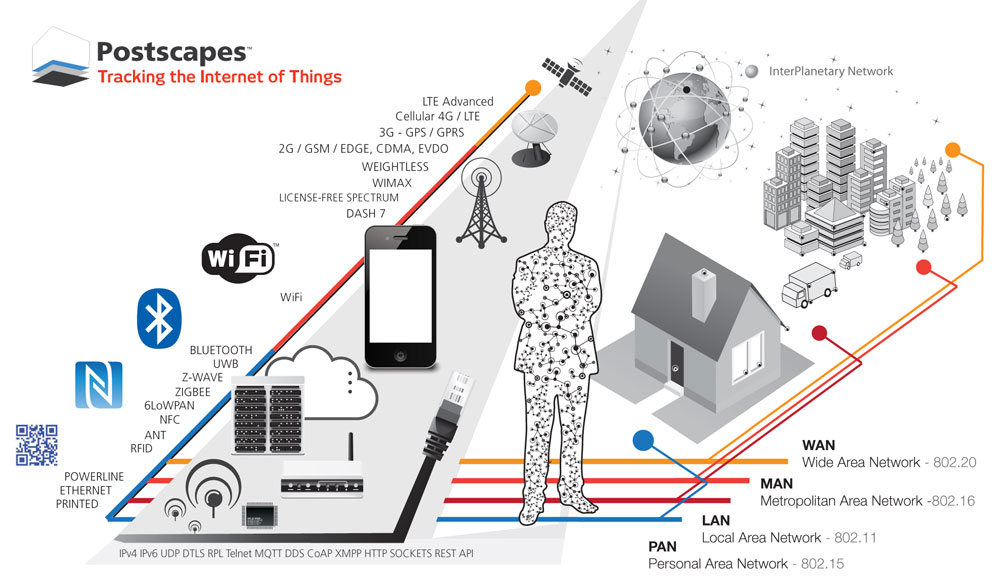
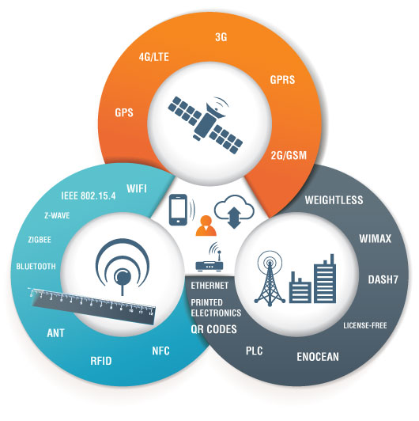

Technologies

# Technologies
---

* **RFID**
* **EnOcean**
* **NFC**
* **Bluetooth**
* **Wi-Fi**
* **3G**
* **4G LTE**
* **ANT**
* **Dash7**
* **Ethernet**
* **GPRS**
* **PLC / Powerline**
* **QR Codes, EPC**
* **WiMax**
* **X10**
* **802.15.4**
* **Z-Wave**
* **Zigbee**

